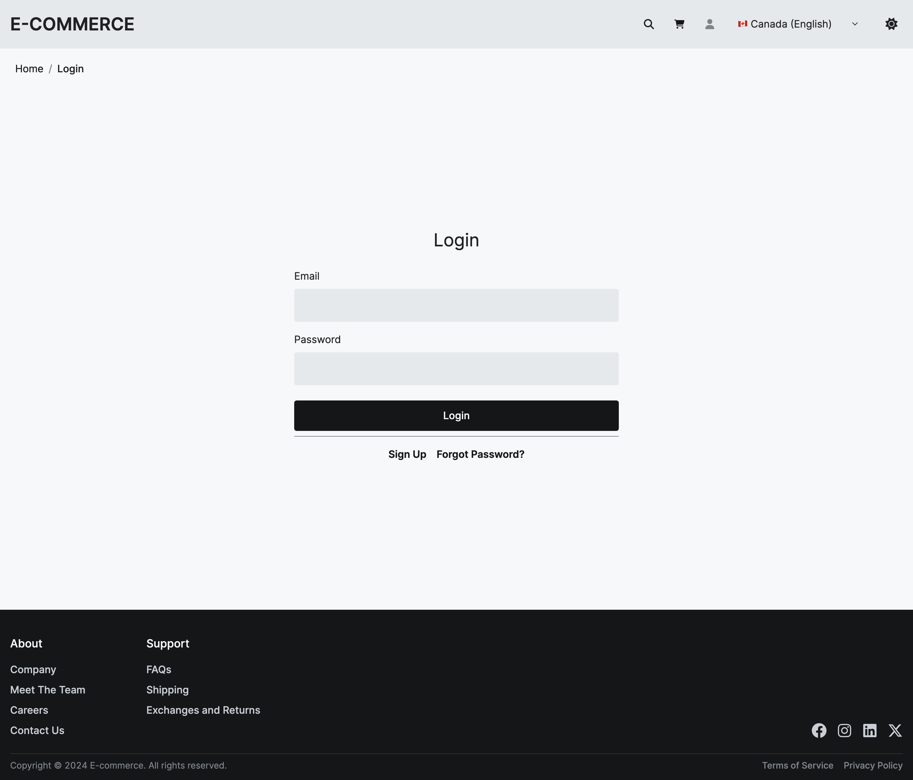

# E-commerce <a name="readme-top"></a>

E-commerce website made with <a href="https://nextjs.org/" target="_blank">Next.js</a>, <a href="https://tailwindcss.com/" target="_blank">TailwindCSS</a>, <a href="https://www.python.org/" target="_blank">Python</a> (<a href="https://www.djangoproject.com/" target="_blank">Django</a> and <a href="https://www.django-rest-framework.org/" target="_blank">Django REST</a>) and <a href="https://www.sqlite.org/" target="_blank">SQLite</a>.


| Home Page                                                            | Login Page                                                            |
| -------------------------------------------------------------------- | --------------------------------------------------------------------- |
|  |  |

## Installation

Clone project

```
git clone git@github.com:Chelny/e-commerce.git
```

### Server

On the `server/` directory, set `.env` file from the provided `.env.example` file.

Open a terminal and go to the `server/` directory:

```
cd server
```

Create and activate virtual environment with:

```
python<version> -m venv <virtual-environment-name>
source <virtual-environment-name>/bin/activate
```

Install dependencies:

```
pip install -r requirements.txt
```

Apply migration (the project uses a database):

```
python manage.py makemigrations
python manage.py migrate
```

Run server:

```
python manage.py runserver
```

### Client

On the `client/` directory, set `.env` file from the provided `.env.example` file.

Open a new terminal and go to the `client/` directory:

```
cd client
```

Install dependencies:

```
pnpm i
```

Run server:

```
pnpm run dev
```

<p align="end">(<a href="#readme-top">back to top</a>)</p>

## Tests

### Server

```
python manage.py test # Run all tests
python manage.py test your_app_name # Run tests for a specific app or module
python manage.py test your_app_name.tests.test_module # Run tests for a specific test file or for a specific test class or method
```

<p align="end">(<a href="#readme-top">back to top</a>)</p>
