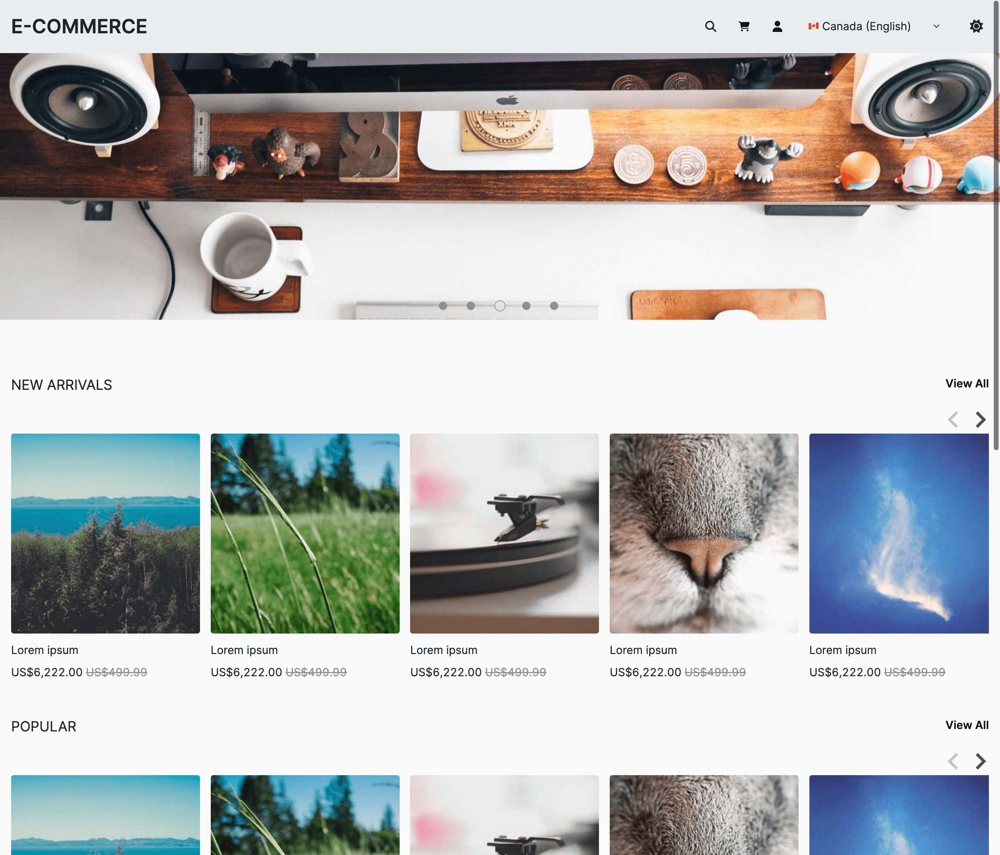
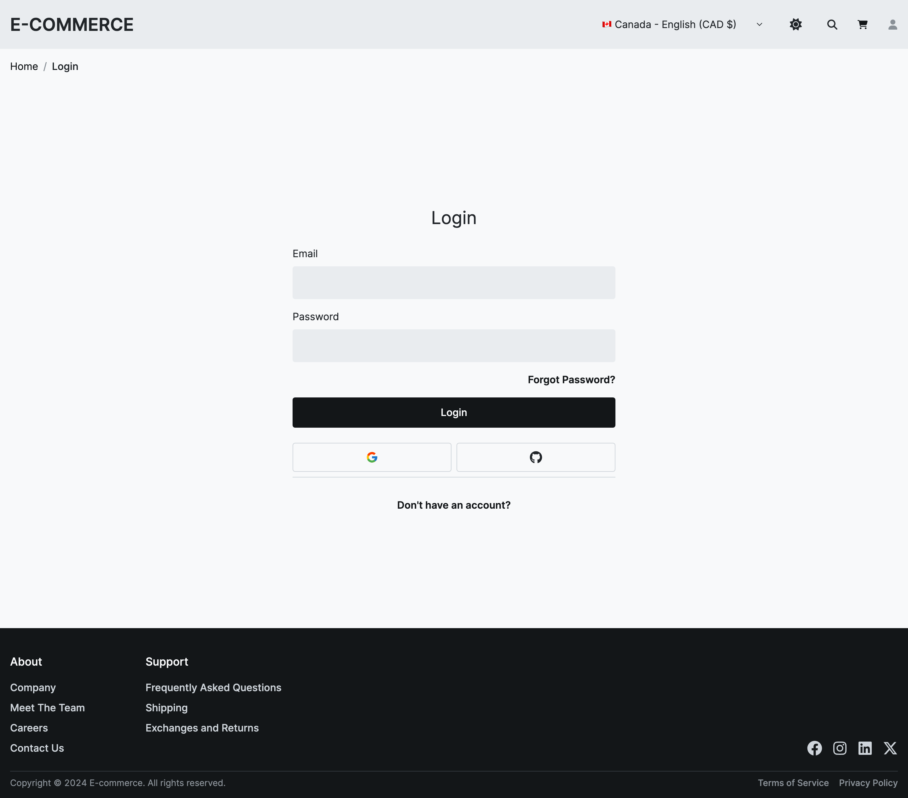

# E-commerce <a name="readme-top"></a>

E-commerce website made with <a href="https://nextjs.org/" target="_blank">Next.js</a>, <a href="https://tailwindcss.com/" target="_blank">TailwindCSS</a>, <a href="https://www.prisma.io/" target="_blank">Prisma</a> and <a href="https://www.postgresql.org/" target="_blank">PostgreSQL</a>.


| Home Page                                                     | Login Page                                                     |
| ------------------------------------------------------------- | -------------------------------------------------------------- |
|  |  |

## Installation

**Clone project**

```
git clone git@github.com:Chelny/e-commerce.git
```

Navigate to the root directory of the project. Create a new file named `.env` and fill it with the required environment variables based on the provided `.env.example` file.

**Install dependencies**

```
pnpm i
```

**Serve the Client**

```
pnpm run dev
```

This command starts the development server, allowing you to access your application locally.

Then, on another terminal...

**Generate Prisma Artifacts**

```
pnpm dlx prisma generate
```

This command generates TypeScript types for your Prisma schema, which allows for type-safe database interactions in your code.

**Push Prisma Schema State to the Database**

```
pnpm dlx prisma db push
```

This command applies the changes in your Prisma schema to the connected database. Ensure your database connection details are correctly configured in your .env file.

**Run SQL Queries**

Navigate to the root directory, where you'll find a folder named `sql/`. Inside this folder, you'll find .sql files designed to be executed in your preferred database GUI tool.

**Browse Your Data**

```
prisma studio
```

This command opens Prisma Studio, a visual interface for exploring and managing your data. Use it to inspect the data in your database.

<p align="end">(<a href="#readme-top">back to top</a>)</p>
